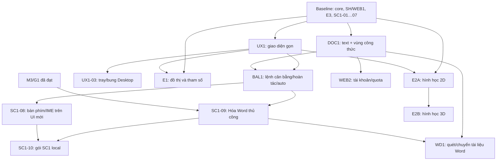

# Roadmap dài hạn Locus

**Ưu tiên cập nhật 05/10/2026:** [tối ưu Công thức Web và design system có catalog](design-system/PLAN.md) trước các nhánh tính năng mới. CT0–CT4 đã triển khai và kiểm local; [kết quả CT4](design-system/CT4-VERIFICATION.md), [đặc tả](design-system/CT4-PLAN.md), [backlog core C01–C08](design-system/CT4-CORE-AUDIT.md). [Catalog 0.2.0 và source](design-system/README.md). Bước sau là review trải nghiệm và chốt đợt mở rộng lõi; Desktop là sản phẩm cài trên máy, có shell, gói và nghiệm thu riêng, chưa có bộ cài mới từ đợt này. Các mốc bên dưới giữ nguyên ngày và phạm vi lịch sử.

Cập nhật 2026-09-30. **G đạt 14/14 task alpha local**, có Web local và Desktop x64 portable dùng thử được. [Báo cáo G](phase-g/REPORT.md), [cách dùng](phase-g/QUICKSTART.md), [biên bản máy](host-review/20260930.md). H/WEB2 chưa triển khai; D-FILE/SC1/Word đa DPI vẫn giữ các cổng còn thiếu. Không coi G hoàn tất là toàn sản phẩm hoàn tất.

## 1. Xuất phát

M0/M1/M2/M3 đã đạt phạm vi nghiên cứu/core/Desktop/Word thủ công tương ứng; WEB0, SH và WEB1 đã có nền Web/Desktop dùng chung. E3 Hóa/Lý alpha đạt 8/8. SC1-01…07 đã đạt local; SC1-09 đã đạt luồng native thủ công theo [báo cáo E](phase-e/REPORT.md). SC1-08/10 còn mở.

SC1 chính đạt 8/10 task (80% theo số task của mốc), W0 đạt 4/6 (67% mốc). Không báo phần trăm toàn sản phẩm từ việc cộng các task khác kích thước. G2/G3 và phản hồi A/B còn chờ; Word hiện có chuyển thủ công, chưa có quyền tự động từ kết quả Web.

F có bản Word 0.5.0 review local: WD1-01/03/04 đã đạt bảng quét/chuyển nhóm/giữ quyết định; WD1-02/05 còn highlight nhiều vùng và ma trận nhiều DPI/màn hình/IME. [Báo cáo F](phase-f/REPORT.md). G hiện có editor sản phẩm, grammar/file riêng, quan hệ hình học, xuất scene và hai gói alpha đã kiểm. Ba walkthrough G đã đạt; phần triển khai tiếp theo là H/WEB2. Các giới hạn máy khác ghi riêng trong biên bản 30/09.

Giữ nguyên các gói/receipt cũ. [Bản kế hoạch trước khi viết lại](archive/20260915-before-wand-plan/manifest.json) được lưu để truy nguyên; các mục dưới là hàng đợi mới, không bắt đầu lại M0/SC1-01.

## 2. Đường đi mới

| Thứ tự từ baseline | Mốc/cụm | Kết quả nhìn thấy được |
| --- | --- | --- |
| 1 | UX1-01 | Wireframe và luồng thao tác: ô nhập/kết quả, đũa thần, selection, options, tray/bung, tab tương lai; review trước code |
| 2 | UX1-02 + DOC1-01/02 | Editor gọn, một ô nhập cho công thức đơn hoặc đoạn dài; trả nguyên đoạn với vùng công thức chọn được |
| 3 | BAL1-01…04 | Cân bằng/hủy từng phương trình, tuần tự, hai batch có hoàn tác chính xác, checkbox auto và quyền giữ nguyên |
| 4 | DOC1-03 + UX1-03 + SC1-08 | Lưu/xuất nguyên đoạn, Desktop tray/bung, chốt các bài bộ gõ/trợ năng trên UI mới; bản Web/Desktop review độc lập |
| 5 | SC1-09 → SC1-10 | Hóa thông minh qua Word thủ công, metadata/Undo; gói SC1 local và phạm vi từng host |
| 6 | WD1-01…05 | Quét tài liệu Word đã có, dấu nhận diện, giữ text, chuyển riêng hoặc chuyển cả tập đủ điều kiện |
| 7 | E1-01 → 04 → 02 → 06 → 03 → 05 | Đồ thị 2D, bảng tham số/slider, chỉnh đường/trục/miền và SVG/PNG |
| 8 | E2A-01 → 02 → 04 → 03 → 05 | Vẽ hình 2D theo thao tác trực tiếp, kéo cạnh/đỉnh, quan hệ, nét và xuất |
| 9 | E2B-01 → 02 → 03 | Hình học 3D, camera/chọn/kéo theo mặt phẳng, hình chiếu SVG |
| 10 | WEB2-01…04 | Chốt cách tính lượt → tài khoản/quyền gói → quota/pilot; online/thanh toán khi các quyết định liên quan đã có |
| Theo phạm vi phát hành | M6-01…04 | Đóng gói/cập nhật, đo hiệu năng, phục hồi và pilot; không trì hoãn mọi bản local tới khi đủ toàn sản phẩm |

Đây là thứ tự ưu tiên cho một luồng thực hiện chính. Nếu Windows/Word bị chặn, bàn giao phần Web/Desktop đã đạt và chuyển E1 đủ đầu vào; SC1-09/10 hoặc WD1 vẫn mở, không giả hoàn thành. WEB2 không chặn khả năng tạo công thức local. M6 nghiệm thu theo danh sách capability đã chốt cho từng bản, không tự biến mọi nhánh tương lai thành phụ thuộc bắt buộc.

## 3. Các nhánh Word có cổng riêng

| Nhánh | Điều kiện | Vị trí trong kế hoạch |
| --- | --- | --- |
| M4 | M3 và nghiệm thu focus/IME/fx của W0-05/G2 tương ứng | Gợi ý khi nhập mới và vòng sửa qua Desktop; có thể lấy khi đủ cổng, không giữ E1 chờ |
| M5A | M4 và G1/G2 | Auto vùng đã đóng, kết quả duy nhất không repair/cảnh báo |
| M5B | W0-06/D-01 có phản hồi, M5A và G3 | Auto-Space trong Word và nhập nối |
| SC1-11 | SC1-09, M4/G2; Space còn cần D-01/G3 | Ghost sản phẩm ngay trong thân Word |

**WD1 quét tài liệu có sẵn là lệnh thủ công**, không cần chờ auto-Space. Riêng dấu highlight/fx inline phải có bằng chứng định vị/zoom/DPI của WD1-02, không dùng nhãn “thủ công” để bỏ qua việc kiểm đó. Nếu chỉ panel điều hướng đạt thì công bố panel, giữ highlight inline chưa đạt.

## 4. Phụ thuộc kỹ thuật chính

E1 không phụ thuộc kỹ thuật SC1 Word/WD1; E2A không cần solver Toán tổng quát. WEB2 có thể đặc tả trước E2B nhưng chỉ cấp lượt/quảng cáo tính năng đã phát hành. Các mũi tên là phụ thuộc kỹ thuật ở mức mốc; thứ tự task chính xác nằm trong backlog.

## 5. Phạm vi cần giữ khi mở rộng

- **Một logic:** Core nhận diện/phân tích/solver; Application giữ tài liệu/lệnh/history; Editor chung cho Web/Desktop; adapter Word phụ trách Range/native/metadata. Không làm solver hoặc parser Hóa thứ hai.
- **Nguồn và kết quả:** tài liệu mới giữ text gốc và kết quả từng vùng. Cân bằng thao tác ở ô kết quả, copy theo kết quả đang thấy; copy nguồn giữ nguyên text. Version/migration được chốt trước code.
- **Quyền chủ động:** chọn giữ phương trình sai được phép; hủy cân bằng không bị auto lặp lại. Cân bằng, suy sản phẩm và chuyển text thành equation là ba thao tác khác nhau.
- **Đoạn dài:** đầu tiên bảo toàn câu chữ/xuống dòng và vị trí công thức; giữ toàn bộ định dạng rich text từ Word là mở rộng sau. Không tăng vô hạn ngân sách parser đơn.
- **Word:** quét không sửa nội dung; mọi commit có kiểm lại mục tiêu và Undo. Highlight không được làm mất màu định dạng ban đầu.
- **Đồ thị/hình học:** vẫn có slider E1, bảng nhiều tham số; hình học có free move và quan hệ do user chọn, 3D giữ cả camera. Không hứa mọi hàm nhiều biến là một đường 2D.
- **Local/online:** tiếp tục local. Chưa triển khai Sites, tài khoản hoặc thanh toán chỉ vì có kế hoạch WEB2.

## 6. Các mốc nghiệm thu và nhịp test

Một cụm được review qua bài người dùng cụ thể rồi mới chạy lượt hồi quy tổng hợp của phần thay đổi. Các thay đổi UI nhỏ chỉ cần build/smoke liên quan; không chạy lại toàn bộ core/browser/OS sau mỗi sửa nhãn. Lỗi mới thì kiểm lại đúng vùng ảnh hưởng, mở rộng khi có lý do.

Bảo toàn nguồn, một Undo, giao dịch Word/batch, migration và trừ lượt đúng vẫn phải được kiểm trước khi dùng dữ liệu thật. Dừng lượt OS khi người dùng đang dùng cửa sổ hoặc công cụ không ổn; ghi bài chưa đạt và làm việc độc lập. Không hỏi lại người dùng về W0 đã được hoãn.

| Bản review | Demo chốt | Phần chưa được gọi là đạt |
| --- | --- | --- |
| UI/đoạn/cân bằng | Dán đoạn trộn → chọn → cân bằng/hủy → batch/hoàn tác → copy/lưu; hai host cùng kết quả | Word SC1, WD1, graph/geometry nếu chưa làm |
| SC1 đầy đủ | UI mới + Telex/VNI đúng build + Word thủ công + gói sau giải nén | Auto Word/SC1-11 |
| WD1 | Quét tài liệu cũ, đánh dấu, bỏ qua, chuyển batch, một Undo, save/reopen | Các story/context/DPI chưa kiểm |
| E1/E2A/E2B | Nhập/kéo/chỉnh → Undo → lưu qua lại → xuất đúng scene | Các loại hàm/hình/chức năng ngoài phạm vi |
| WEB2/M6 | Quota/user flow/gói hiện có và pilot theo capability | Giá/online/thanh toán khi chưa chốt |

Chỉ công bố % theo mốc có mẫu số ổn định và kèm phạm vi; không biến một nút đã vẽ hoặc tài liệu đã viết thành task tính năng DONE.
