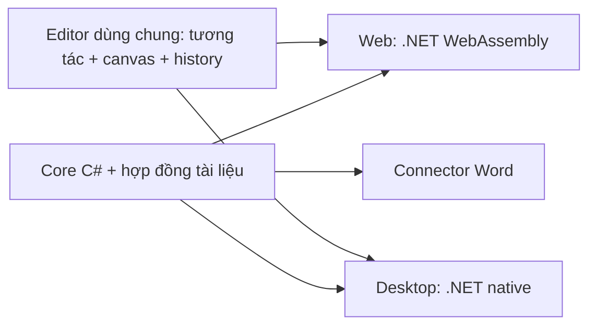

# Thiết kế Web, đồ thị, hình học và Lý/Hóa

**Bổ sung ngày 2026-09-17:** [Đặc tả editor đợt G](phase-g/EDITOR-SPEC.md) ghi yêu cầu mới: nhập → LaTeX, tham số một dòng trong khung cuộn; điểm kéo trực tiếp, bắt điểm; đầy đủ nhóm góc/đo/phép dựng/trình bày cho 2D/3D. Đây là thiết kế, không thay đổi trạng thái nghiệm thu bên dưới.

Ngày cập nhật: 2026-09-15. Người dùng yêu cầu Web song song Desktop, dùng chung logic. **M3, WEB0, SH, WEB1 và E3 đã đạt phạm vi riêng; online hoãn theo yêu cầu. Kế hoạch mới lấy SC1 cặp bọc/Hóa thông minh trước E1.** SC1-01…07 đã đạt trên Web/Desktop. Ưu tiên mới: UX1 giao diện gọn + DOC1 nguyên đoạn + BAL1 đũa thần → phần SC1 Word/gói + WD1 → E1/E2 → WEB2. [Baseline](BASELINE-20260915.md), [các bước cụ thể](NEXT-STEPS.md). Chưa code các ý mới. [Kế hoạch SC1](sc1/PLAN.md), [kế hoạch Lý/Hóa](e3/PLAN.md), [báo cáo WEB1](web1/REPORT.md), [quyết định kiến trúc](web/ARCHITECTURE.md), [thiết kế E1 giữ để tiếp tục](e1/PLAN.md).

[ROADMAP](ROADMAP.md) quyết định thứ tự mốc, [BACKLOG](BACKLOG.md) ghi trạng thái từng task, [NEXT-STEPS](NEXT-STEPS.md) ghi các bước và bài demo. Tài liệu này giữ cơ sở thiết kế và nguồn tham khảo, không duy trì một roadmap thứ hai.

## Hiện có gì

| Phần | Thành tựu được kiểm chứng |
| --- | --- |
| M0 | Hợp đồng sản phẩm, grammar/corpus ban đầu và hướng kiến trúc |
| M1 | Core C# .NET Standard 2.0, nguồn và ánh xạ UTF-16, parser/candidate, MathML/OMML/LaTeX/snapshot; 238 nhóm kiểm tra đạt |
| M2 | Desktop WPF alpha độc lập, nhập/chọn/preview/cặp bọc tùy chỉnh, xuất SVG/PNG/văn bản; 40 nhóm kiểm tra và bằng chứng bộ gõ/clipboard |
| W0 | Add-in nghiên cứu Word thật, native/metadata/Undo/restore/detach, lifecycle/focus; thêm fx và hai biến thể nhập nối A/B |
| Nghiệm thu W0 | 4/6 hạng mục, 67% theo số hạng mục đóng; còn quan sát/click/DPI thực và người thử/D-01. Người dùng sẽ phản hồi sau |
| M3 | Word alpha thủ công, 4/4 task và G1 theo baseline x86 |
| WEB0 | Core WASM, 116 nguồn tương đương, editor nhỏ/Scene chung, số đo tải và gói static; 3/3 task thử kiến trúc |

[Chỉ mục W0](../artifacts/w0/acceptance.json) ghi 36 adapter PASS + 1 OBSERVED, 7 add-in lifecycle PASS, 2 Desktop–Word PASS và 7 UX research PASS. Sáu nhóm Windows input cho Space được ghi riêng. Những bài này không biến connector nghiên cứu thành tính năng Word đã phát hành.

Trang thử M1 ở cổng 4180 vẫn cần server phân tích .NET. Bản WEB0 mới ở cổng 4181 serve tệp tĩnh, core chạy trong browser. Có canvas tam giác và curve JSXGraph thử; chưa có editor đồ thị/hình học sản phẩm. Parser Lý/Hóa được nghiệm thu sau đó trong [E3](e3/REPORT.md).

## Thứ tự thực hiện đã cập nhật

M3 đã có luồng chọn vùng → preview/chọn kết quả → xác nhận → native. WEB0, SH và WEB1 đã hoàn thành phạm vi tương ứng; E3 đã đạt alpha local 8/8. Task kế tiếp là **UX1-01 thiết kế/review**; SC1-01…07 đã đạt, giữ phần SC1 còn thiếu để kiểm/tích hợp sau UI mới. DOC1/BAL1 mở rộng kết quả theo vùng và lệnh cân bằng, không thêm tab môn học. [Báo cáo E3](e3/REPORT.md), [SC1](sc1/PLAN.md). [Thiết kế E1](e1/PLAN.md) và yêu cầu thanh trượt được giữ theo NEXT-STEPS; có thể lấy E1 khi Word chờ và E1 đủ đầu vào. Ghost Word và auto-Space giữ cổng riêng; phản hồi W0 còn chờ.

Roadmap hiện hành thay thứ tự cũ đặt nhánh mở rộng sau M6. Hàng đợi cho một luồng thực hiện:

| Mốc | Đầu ra có thể đánh giá | Điều kiện trước khi nhận là đã xong |
| --- | --- | --- |
| M3 → WEB0 | Word thủ công, sau đó core browser và thử UI chung | Word giữ nguyên vùng/Undo; browser cho cùng nguồn/candidate/snapshot với native |
| SH → WEB1 | Editor chung và web công thức alpha local đã đạt phạm vi riêng | Nháp, clipboard, offline/cập nhật, file qua lại và bộ gõ trên baseline công bố |
| E3 → E3B → E3A | Ưu tiên mới: nền miền, Hóa cơ bản, Lý cơ bản | Corpus/serializer/export đúng; Word của mỗi miền có nghiệm thu riêng |
| SC1 | Cặp theo môn, cân bằng/kho/ghost Web/Desktop đã đạt 01…07; tiếp phần Word/gói | Phần kiểm OS, Word và gói còn mở; ghost inline Word riêng |
| UX1/DOC1/BAL1 | Editor gọn, dán nguyên đoạn, selection kết quả, đũa thần/hoàn tác/auto, tray | [Tương tác](ux1/BALANCE-INTERACTION.md), file/selection/nguồn/Undo và hai host |
| WD1 | Quét tài liệu Word có sẵn, dấu nhận diện/fx, chuyển riêng/tất cả | Quét không ghi, keep-text/ignore, batch/Undo và định vị inline có phạm vi |
| WEB2 | Tài khoản/quota theo gói | Chốt lượt/offline/reset, ledger/pilot; online/thanh toán quyết định riêng |
| E1 | Đồ thị 2D/thanh trượt tham số trong Web/Desktop, sau Lý/Hóa | Nhập hàm, kéo tham số/Undo, miền/trục/nét, lưu/mở giữ cấu hình, copy/xuất; không nối sai qua gián đoạn |
| E2A | Hình học 2D thao tác như trên giấy | Kéo điểm/cạnh, nét/nhãn, quan hệ được chọn, Undo/lưu-mở và xuất đúng trạng thái |
| M4 → M5A → M6 | fx và chỉnh qua Desktop, auto vùng đủ cổng, ổn định/pilot | Phạm vi phát hành có bằng chứng; W0 chờ thử không được tự ghi đã đạt |
| E2B | 3D thật: camera, kéo theo mặt phẳng/chiều sâu, hình chiếu/nét khuất | Quy tắc thao tác và SVG hình chiếu có kiểm chứng; kỹ thuật chỉ phụ thuộc E2A |

Đây là thứ tự ưu tiên, không phải lịch ngày hoặc yêu cầu mọi nhánh phải chờ hàng trước. Chưa có số đo tốc độ xây Web/editor để gán ngày phát hành. M5B chỉ lấy khi D-01 và cổng Space đủ đầu vào. Nếu Word chờ phản hồi/cổng, tiếp tục nhánh độc lập theo NEXT-STEPS; Hóa/Lý không chờ 3D hoặc mọi chế độ auto Word.

## “Vẽ như con người” nên có nghĩa gì

Tập trung trước vào **chuỗi thao tác trực tiếp**: đặt điểm, kéo nét, nối hai điểm, đặt tâm và mở bán kính, di chuyển/đổi nét/đặt tên. Có thể dựng hình minh họa không gian trên mặt phẳng giấy trước khi có editor 3D xoay thật.

Ví dụ: đặt A/B/C → nối tam giác → kéo C → tạo đường cao AH → đổi AH sang nét đứt → kéo nhãn → chuột phải copy SVG. Kéo C phải cập nhật những đối tượng liên quan theo quan hệ đã được tạo.

Hai cách thao tác cần rõ:

- **Tự do:** điều chỉnh hình cho dễ nhìn; snap có thể bật/tắt. Kéo một cạnh tự do dịch hai đầu cạnh, các cạnh dùng chung đỉnh cập nhật theo. Nét vẽ phác vẫn có thể giữ là stroke nếu người dùng muốn.
- **Dựng theo quan hệ:** người dùng chọn trung điểm, song song, vuông góc, điểm trên đường tròn… Khi kéo, giữ các quan hệ đó. Không tự khóa quan hệ chỉ vì hai nét trông gần vuông góc.

Đối tượng có ID và quan hệ; preview và xuất đi từ scene hiện tại. Lưu hành động có nghĩa như đặt điểm, nối đoạn, di chuyển, đổi kiểu nét sẽ hỗ trợ Undo/Redo; sau này có thể phát lại các bước dựng. Một lần kéo là một bước Undo hoàn chỉnh. Hiệu ứng nét giống bút tay là tùy chọn trình bày; nó không cung cấp mô hình hình học hoặc lịch sử dựng.

Đồ thị hàm số dùng quy trình khác: nhập hàm → tạo tham số nếu có → chọn miền → kéo/chỉnh → chỉnh trục/nét/nhãn. `PlotDocument` giữ nguồn/candidate, miền, khung nhìn và bảng tham số dùng chung (giá trị/khoảng/bước); `GeometryDocument` giữ điểm/cạnh/quan hệ. Cùng dùng nhãn toán, lưu/mở, công cụ chọn/kéo và xuất; không ép scene hình học vào AST công thức. Một drag tham số là một Undo; thay hệ số không sửa nguồn công thức và phải cập nhật cả miền xác định.

## Repo và tài liệu đáng tham khảo

Đã đọc nguồn chính của dự án ngày 2026-09-13. Đến 2026-09-14 đã chạy adapter thử JSXGraph 1.13.3 ở WEB0; các thư viện còn lại chỉ là tham khảo, chưa tích hợp vào Locus.

| Dự án | Nên học hoặc thử dùng cho Locus | Phạm vi cần tự xây |
| --- | --- | --- |
| [JSXGraph](https://github.com/jsxgraph/jsxgraph) | Đồ thị hàm, hình học tương tác, SVG/canvas; có nhiều ví dụ. Repo cung cấp lựa chọn MIT hoặc LGPL | UX tiếng Việt, tài liệu Locus, lệnh/Undo, cách lưu, quyền lựa chọn, nguồn công thức. Là ứng viên đầu tiên để spike math canvas |
| [Excalidraw](https://github.com/excalidraw/excalidraw) | Chọn/kéo, thao tác bút/đường/hình, Undo/Redo, zoom/pan và xuất SVG/PNG; MIT | Ràng buộc hình học, ngữ nghĩa công thức và đồ thị. Học tương tác; chưa mặc định ghép nguyên editor với JSXGraph |
| [CindyJS](https://github.com/CindyJS/CindyJS) | Dựng hình từ phép toán và quan hệ; gallery có ví dụ tương tác. Package khai báo Apache-2.0 | Không dùng CindyScript làm parser công thức tiếng Việt thứ hai; đánh giá mô hình dựng trước khi chọn engine |
| [function-plot](https://github.com/mauriciopoppe/function-plot) | Editor đồ thị hàm 2D nhỏ, cập nhật theo miền khi zoom; MIT | Grammar Locus, kiểm miền/gián đoạn, trạng thái tài liệu và xuất. Ứng viên đối chiếu nếu chỉ cần đồ thị |
| [Rough.js](https://github.com/rough-stuff/rough) | Tạo đường/hình có vẻ như phác tay trên SVG/canvas; MIT | Chỉ là cách vẽ nét: không tự có chọn/kéo, constraint hoặc history |

Nguồn xác nhận tính năng: [README Excalidraw](https://raw.githubusercontent.com/excalidraw/excalidraw/master/README.md), [README CindyJS](https://raw.githubusercontent.com/CindyJS/CindyJS/main/README.md), [package CindyJS](https://github.com/CindyJS/CindyJS/blob/main/package.json), [README Rough.js](https://raw.githubusercontent.com/rough-stuff/rough/master/README.md), [giấy phép Rough.js](https://raw.githubusercontent.com/rough-stuff/rough/master/LICENSE). Đây là lọc dependency ban đầu; khi tích hợp cần cố định phiên bản và kiểm giấy phép của phần thật sự sử dụng.

[tldraw](https://github.com/tldraw/tldraw) cũng đáng học về editor; repo hiện ghi production cần license key. Vì vậy chưa ưu tiên chọn làm dependency mặc định. Tham khảo ý tưởng UX khác với đưa cả SDK vào sản phẩm.

## Web và Desktop dùng logic giống nhau

Định hướng: cùng core, phiên bản grammar, nguồn/candidate, định dạng tài liệu và bộ kiểm; editor mới dùng cùng module trên web và trong app. Chỉ phần tích hợp với host như clipboard, lưu file và Word khác nhau.

WEB0 đã chọn Blazor WebAssembly cho browser và Blazor Hybrid/WPF cho editor chung. Core đang dùng chạy được trong WASM theo baseline; renderer WPF, COM Word và toàn bộ ứng dụng M2 không tự chuyển thành mã browser. [Quyết định sau thử nghiệm](web/ARCHITECTURE.md). Microsoft hỗ trợ tái sử dụng Razor components trong WPF qua BlazorWebView. [Hosting models](https://learn.microsoft.com/en-us/aspnet/core/blazor/hosting-models?view=aspnetcore-10.0), [Blazor Hybrid với WPF](https://learn.microsoft.com/en-us/aspnet/core/blazor/hybrid/?view=aspnetcore-10.0).

Web xử lý nguồn trong browser. Sau khi tải/cache tài nguyên cần thiết, bản PWA có thể hướng tới offline. “Cùng logic” không tự có nghĩa “đồng bộ dữ liệu giữa hai thiết bị”: trước hết dùng cùng file lưu/mở; tài khoản/cloud sync là quyết định riêng. Clipboard và truy cập file của browser cần triển khai theo khả năng host. Native equation trong Word vẫn đi qua connector Word.

Các phần kiểm chứng và tách dùng chung được phân task như sau (WEB0 là tên chính thức của “Web-00” trong trao đổi trước):

1. WEB0-01/02: chạy core thật trong browser, kiểm NFC/NFD/emoji/offset, candidate ID, SHA-256 và DataContractJsonSerializer sau publish/trimming; so snapshot/candidate/LaTeX/OMML với native. Đo payload, khởi động, thời gian phân tích và nhập tiếng Việt.
2. WEB0-03: nhúng một canvas nhỏ vào Web và app với cùng state và thao tác; kiểm tạo/kéo/Undo/SVG, rồi ghi quyết định stack/dependency.
3. SH-01 đến SH-04: tách phiên và logic khỏi clipboard/WPF, dựng editor/renderer và lưu/mở chung. Renderer hiện ở WPF nên chia sẻ parser chưa tự chia sẻ renderer.
4. WEB1: UI công thức hoàn chỉnh, adapter clipboard/file, nháp, build tĩnh và offline/cập nhật thực. Chỉ công bố browser/host đã kiểm.
5. E1: core quyết định công thức; renderer nhận AST/callback hoặc điểm/đoạn do evaluator chung tính. Giữ rõ các đoạn tách do miền/gián đoạn; không đưa nguồn người dùng vào parser thư viện để thay core.

Không thay toàn bộ Desktop M2 trong một lần. Các tab mới có thể đi theo editor chung; phần đang chạy ổn được chuyển dần sau khi có bằng chứng tương đương.

## Phạm vi Lý/Hóa đầu tiên

Giao diện dùng nguyên bản Toán, thêm checkbox nhận diện Toán/Lý/Hóa trong tùy chọn; người dùng có thể bật cùng lúc. Không có bộ chọn môn riêng hoặc thay đổi luồng nhập/preview/sửa/copy. Các checkbox chỉ giới hạn miền tham gia nhận diện; Cách đọc/marker và snapshot hiện có giữ hợp đồng. Quy tắc tám tổ hợp và xung đột ở [kế hoạch E3](e3/PLAN.md).

Hóa: `H2SO4`, `Ca(OH)2`, hệ số, điện tích và mũi tên phản ứng. Nhận diện token nguyên tố, hoa/thường, nhóm và chỉ số; `Co` khác `CO`. Chuỗi giống chữ thông thường cần đủ ngữ cảnh trong những miền được bật; không coi mọi chuỗi chữ hoa là hóa chỉ vì checkbox Hóa bật. Không tự sửa hoa/thường hoặc cân bằng phản ứng. Model hóa học/serializer/export phải mở rộng có phiên bản; không chỉ thay số thành chữ nhỏ bằng regex.

Lý: vector, chỉ số, chữ Hy Lạp, đơn vị và ký hiệu thông dụng. Tách biến với đơn vị bằng ngữ cảnh hoặc chế độ; giữ đúng ký hiệu qua preview và xuất. Chưa suy ra giải bài, xác nhận phương trình vật lý hoặc mô phỏng chuyển động.

Hai phần chia sẻ nền mở rộng miền nhưng không cần chờ nhau hoặc chờ 3D. Trước khi nhận là hỗ trợ Word, mỗi cấu trúc mới phải được kiểm native/metadata/restore tại connector, không chỉ thấy đúng trên web.
