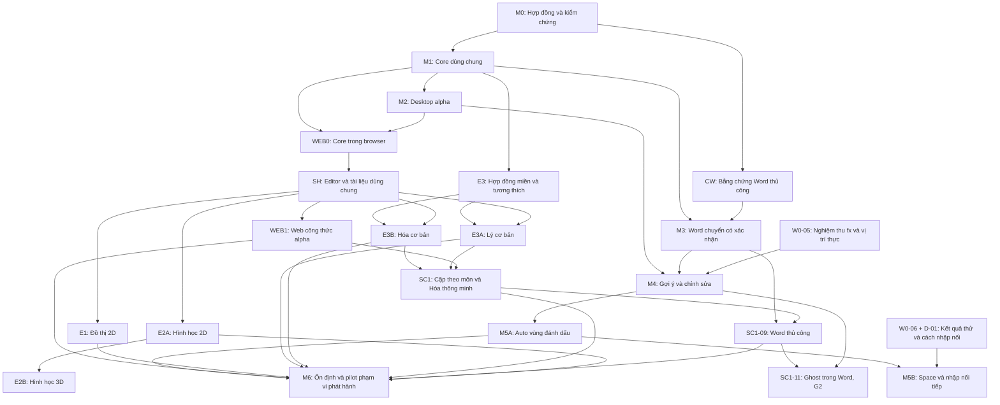

# Roadmap dài hạn Locus

Ngày cập nhật: 2026-09-15. **Kế hoạch mới: E3 đã đạt → SC1 cặp bọc theo môn và Hóa thông minh → E1 đồ thị/thanh trượt.** SC1-01…06 đã đạt local, đang nghiệm thu ghost SC1-07; giữ toàn bộ thiết kế E1 để tiếp tục sau SC1 alpha. M3 đạt alpha thủ công, WEB0 đạt prototype, SH đạt 4/4. WEB1 đạt alpha local 4/4, gồm Telex/VNI OS trên WASM trong Windows WebView2; online hoãn theo yêu cầu. [Kế hoạch SC1](sc1/PLAN.md), [kế hoạch Lý/Hóa](e3/PLAN.md), [trạng thái WEB1](web1/REPORT.md), [phạm vi bộ gõ](web1/IME.md).

**Hiện trạng:** M1/M2/M3 đã đạt phạm vi alpha; WEB0 đạt prototype 3/3; SH đạt nền editor chung 4/4; WEB1 đạt alpha local 4/4. M3 mở G1 cho chuyển thủ công trên Word x86; W0 vẫn 4/6 hạng mục, G2/G3 chưa đạt. E3 Hóa/Lý đã đạt alpha local 8/8, gồm Word thủ công. Đồ thị/hình học chưa được nghiệm thu. [E3](e3/REPORT.md). [WEB1](web1/REPORT.md), [SH](sh/REPORT.md), [WEB0](web/COMPATIBILITY.md), [M3](m3/REPORT.md), [M2](m2/REPORT.md), [W0](w0/REPORT.md).

Đọc [các bước thực hiện tiếp theo](NEXT-STEPS.md) để lấy việc theo đợt và xem bài demo; [backlog](BACKLOG.md) ghi trạng thái, phụ thuộc và bằng chứng từng task. [Thiết kế Web/editor và repo tham khảo](WEB-AND-VISUAL-EDITORS.md) giải thích lựa chọn kiến trúc.

## 1. Cách đọc và điều chỉnh kế hoạch

Kế hoạch tổ chức theo đầu ra có thể dùng thử, với một luồng triển khai chính. Mỗi đợt có demo và bằng chứng riêng. Ước lượng sau khi đọc mã của task, cập nhật sau mỗi đợt; số đo WEB0 chứng minh tính khả thi, chưa đủ để gán ngày phát hành SH/WEB1/editor.

| Ưu tiên mặc định | Mốc | Kết quả cho người dùng |
| --- | --- | --- |
| 1 | M3 | Chọn vùng → preview → xác nhận → native Word; Undo/restore |
| 2 — DONE prototype | WEB0 | Core chạy thật trong browser, quyết định cách dùng chung UI đã có |
| 3 | SH + WEB1 | Editor chung, web công thức alpha và vòng lưu/mở giữa Web/Desktop |
| 4 | E3 → E3B → E3A | Hóa cơ bản trước, Lý cơ bản kế tiếp; cùng Web/Desktop, nghiệm thu Word riêng từng miền |
| 5 — Kế hoạch mới | SC1-01…10 | Cặp chung/riêng, cân bằng, suy sản phẩm có điều kiện, ghost Web/Desktop và Word thủ công |
| 6 | E1 | Đồ thị hàm 2D và tham số chỉnh được, xuất SVG/PNG trên hai host; tiếp tục thiết kế đã có |
| 7 | E2A | Hình học 2D: đặt/nối/kéo, quan hệ được chọn, Undo, lưu/mở, copy SVG |
| 8 | M4 → M5A | Gợi ý fx, chỉnh qua Desktop, tự chuyển vùng đóng đủ điều kiện |
| 9 | M6 | Đóng gói, cập nhật, phục hồi và pilot phạm vi đã công bố |
| 10 | E2B | Hình học 3D: camera, thao tác chiều sâu và SVG hình chiếu |
| Khi đủ cổng | SC1-11 | Ghost trực tiếp trong thân Word; cần M4/G2, nhận bằng Space cần D-01/G3 |
| Khi đủ cổng | M5B | Space theo D-01 đã chốt và G3 đã đạt |

Đây là thứ tự ưu tiên cho một luồng công việc, không phải mọi hàng đều phụ thuộc kỹ thuật vào hàng trước. WEB0 có thể bắt đầu nếu M3 bị chặn; E3 không cần Word tự động; E2B có thể tiếp tục khi E2A đạt nếu nhánh Word đang chờ. Phản hồi W0 được giữ ở [checklist](w0/PENDING-ACCEPTANCE.md), không giữ toàn bộ dự án để chờ A/B.

Phát hành tăng dần: M2 Desktop alpha đã có; M3 Word thủ công, WEB1 web công thức, E1 đồ thị và E3A/B các miền được nghiệm thu riêng. M6 là đợt ổn định phạm vi công bố. M5B và E2B có phiên bản riêng khi đạt; không được ghi đã hỗ trợ trong bản phát hành trước đó.

## 2. Phụ thuộc chính

Mũi tên ghi phụ thuộc kỹ thuật/nghiệm thu ở mức mốc; task cụ thể theo backlog. E1/E2A/E3 có thể chuẩn bị độc lập khi đủ đầu vào, không có cạnh phụ thuộc từ M6. SH bao gồm host Desktop nên E1/E2A không cần chờ phát hành URL web; bản dùng được trên cả hai host phải có bằng chứng từng host.

E3A/E3B cần M3 cho phần chèn Word; khả năng nhập/preview/export Desktop/Web không phụ thuộc vào việc nghiệm thu Word của miền đó. M4 cần thêm bằng chứng IME/focus theo G2 ngoài W0-05. M5A cần G1/G2; M5B cần thêm D-01/G3. M6 mặc định nghiệm thu các nhánh ở bảng ưu tiên đã đi trước nó; nếu giảm phạm vi phát hành thì ghi rõ thay đổi, giữ các mốc chưa đạt mở.

SC1 alpha dùng nền E3/WEB1 và M3 cho phần Word thủ công. E1 không phụ thuộc kỹ thuật vào SC1; việc lấy SC1 trước là cập nhật ưu tiên. Ghost Word SC1-11 có cổng riêng, không nhận là đã đạt từ ghost Web/Desktop và không giữ các editor khác để chờ W0.

## 3. Trục chính

### M0 — Hợp đồng sản phẩm và kiểm chứng Word

**Kết quả:** biết chính xác đang xây hành vi nào và có bằng chứng cho con đường tích hợp Word. **Nghiên cứu DONE.** Tại thời điểm đóng M0: C0 đạt, G0 chọn hướng COM, CW chưa đạt. W0 sau đó mở CW cho baseline thủ công. Các giới hạn Undo/selection, IME/focus và metadata được chuyển thành W0-01 đến W0-06 trong backlog; không được xem là đã nghiệm thu toàn bộ Word.

Công việc:

- Kiểm tra mã hoặc prototype có sẵn nếu được đưa vào workspace; đầu M0 workspace trống, cuối M0 đã có các prototype được liên kết trong báo cáo.
- Chuyển tình huống sử dụng thành corpus nguồn/vùng/candidate/quyền chuyển đổi, gồm cả văn xuôi xen công thức.
- Thử native equation, metadata, một bước Undo, nội dung thay đổi trong lúc chờ và sửa trực tiếp trong Word.
- Thử IME tiếng Việt, focus thật, nhập liên tục, nhiều tài liệu/cửa sổ và lifecycle Desktop–Word.
- So sánh hai hướng connector ở mức đủ bằng chứng để chọn một hướng; không xây hai sản phẩm song song.
- Chốt phạm vi ngữ pháp đầu, baseline môi trường, hợp đồng offset và các quyết định D-01 đến D-05 đủ cho mốc tiếp theo.

**Hai cổng đầu ra:** `C0` đạt khi hợp đồng nguồn/vị trí, grammar đầu, candidate và corpus đủ rõ để triển khai core; `CW` đạt khi có bằng chứng cho đường Word có xác nhận. C0 không yêu cầu toàn bộ spike Word hoàn tất.

**Điều kiện hoàn thành nghiên cứu M0:** có báo cáo spike tái hiện được, quyết định kiến trúc hoặc blocker cụ thể, ma trận hỗ trợ ban đầu và trạng thái từng cổng C0/CW. D-01 có thể còn thử nghiệm nhưng phải có tiêu chí và cổng riêng cho M5B. Đóng nghiên cứu không có nghĩa mọi tính năng Word đều khả thi.

**Nhánh dự phòng tại thời điểm M0:** nếu CW chưa đạt thì tiếp tục M1–M2 và giữ M3 chưa đủ đầu vào. Sau đó W0 đã mở CW và M3 đã hoàn thành alpha thủ công; yêu cầu native equation được giữ nguyên.

### M1 — Core tối thiểu và corpus hồi quy

**Kết quả:** cùng một nguồn cho cùng kết quả trên mọi kênh dùng core.

**Trạng thái: DONE trong phạm vi grammar đầu.** Build Release, 238/238 nhóm kiểm tra, 16 kiểm tra HTTP và cùng DLL trên hai runtime đạt. Preview MathML, OMML/LaTeX và snapshot dùng cùng candidate; SVG/PNG thuộc M2. [Bằng chứng và phạm vi nghiệm thu](m1/REPORT.md).

Công việc:

- Bảo toàn nguồn và ánh xạ chuẩn hóa; nhận diện các vùng công thức.
- Ngữ pháp đầu có số, biến, nhóm ngoặc, phép toán cơ bản, lũy thừa, căn và phân số cùng các alias đã chốt.
- MathDocument có kiểu rõ ràng; candidate phân biệt diễn giải và sửa; chẩn đoán nêu đúng vùng nguồn.
- Các bộ xuất/renderer nhận cùng candidate. Không hứa đồng nhất từng pixel giữa renderer và Word; cần đồng nhất cấu trúc và nội dung toán.
- Corpus versioned, test bất biến nguồn/vị trí và kiểm tra đầu vào lỗi, dài hoặc khó phân tích.

**Điều kiện hoàn thành:** toàn bộ corpus đã duyệt cho ngữ pháp đầu đạt; không có sửa lỗi đi vào auto; kết quả tối đa ba; ánh xạ nguồn và vòng serialize/deserialize không làm mất dữ liệu. Mọi cú pháp chưa hỗ trợ có hành vi từ chối hoặc cảnh báo đã xác định.

### M2 — Desktop alpha độc lập

**Kết quả:** mở ứng dụng, nhập công thức, chọn preview và sao chép dùng được mà không mở Word.

**Trạng thái: DONE cho alpha trên baseline Windows x64 hiện tại.** WPF dùng core M1; scene chung cho preview/SVG/PNG, cặp dấu tùy chỉnh, clipboard và gói portable. Có 40 nhóm Desktop, phím Telex/VNI thật, Undo/Redo/chọn repair và 8 bài clipboard Word; PNG nhận lại khớp pixels. [Bằng chứng và giới hạn native capture, hộp lưu, SVG/MathML trong Word](m2/REPORT.md). Ma trận phát hành rộng tiếp tục ở M6.

Công việc:

- Editor, preview, kết quả và cảnh báo; hỗ trợ nhập tiếng Việt đang composition.
- Xuất SVG, PNG và các loại văn bản đã chốt; kiểm tra clipboard trên ứng dụng đích đại diện.
- Bàn phím, focus, lỗi nhập và trạng thái đang phân tích không làm mất nội dung.
- Cài/chạy thử cục bộ trên baseline, có màn hình kết nối Word phản ánh trạng thái thật.

**Điều kiện hoàn thành:** chạy độc lập không cần Word và mạng cho nhận diện/dựng công thức; các bài nhập–chọn–copy đạt; không hiển thị candidate cũ sau khi nguồn thay đổi; giới hạn clipboard được ghi rõ cùng cách xuất file tương ứng.

### W0 — Hoàn tất bằng chứng đường Word

**Trạng thái: 4/6 hạng mục DONE; CW mở trong phạm vi baseline.** Giao dịch native/metadata/Undo, lifecycle, Telex/VNI, focus và clipboard bằng phím có bằng chứng. [Báo cáo W0](w0/REPORT.md) ghi số kiểm tra cuối, cách chạy lại và giới hạn.

Đã sửa con trỏ sau chuyển thủ công: 30 ca API và phím VNI xác nhận văn bản nằm ngoài equation, metadata/Undo nguyên vẹn. Đợt tiếp theo đã có badge với clipping/zoom/scroll/hết hạn và hai biến thể giữ phiên A/B trong Word thật. W0-05 còn nghiệm thu nhìn/click và DPI/màn hình thực; W0-06 còn người thử và chốt D-01. Người dùng đang bận, các bước được gom tại [checklist](w0/PENDING-ACCEPTANCE.md). Công cụ đã gõ phím được nhưng capture/click vẫn lỗi. Các phần còn mở không chặn khởi đầu M3 thủ công; chúng vẫn chặn tính năng liên quan ở M4/M5B.

### M3 — Word chuyển có xác nhận

**Kết quả:** chọn một vùng văn bản, chọn kết quả và chuyển thành công thức Word native.

**DONE cho alpha, 4/4 task; G1 đạt theo baseline Word x86.** Có luồng đọc/preview, commit, restore/detach và gói thử cài/gỡ. Đạt 38 nhóm M3, 7 nhóm preview, 10 kiểm tra bàn phím cùng hồi quy; ngữ cảnh ngoài phạm vi từ chối. Pointer click và DPI thực chưa nghiệm thu; không mở auto từ kết quả này. [Bằng chứng/giới hạn](m3/REPORT.md), [cài và dùng](m3/QUICKSTART.md). WEB0, SH, WEB1 và E3 đã được thực hiện sau M3; hàng đợi theo kế hoạch mới bắt đầu ở SC1-01.

Công việc:

- Connector dùng core chung; lệnh chuyển vùng lựa chọn trước để kiểm chứng đường ghi đơn giản.
- Gắn metadata và định danh kết quả; xác minh lại ngay trước commit.
- Gộp thao tác để Undo chính xác, xử lý lỗi giữa các bước và nhiều tài liệu.
- Khôi phục nguồn, detach, save/reopen và tài liệu mở trên máy không có Locus.
- Tách nút/lệnh sản phẩm khỏi probe; có gói thử, cách cài/gỡ và ma trận hỗ trợ. Kiểm thao tác thật trước khi mở G1.

**Điều kiện hoàn thành:** native equation sửa được; một Undo trả lại nội dung và trạng thái liên quan; nguồn khôi phục nguyên văn; thao tác đang chờ bị hủy khi tài liệu/vùng/nguồn không còn khớp; lỗi giữa commit không để tài liệu trong trạng thái nửa chừng.

### M4 — Gợi ý khi gõ và vòng chỉnh sửa

**Kết quả:** người dùng soạn bình thường, thấy `fx` đúng vùng và kiểm soát toàn bộ chuyển đổi.

Công việc:

- Theo dõi cửa sổ nhập nhỏ, xác định đoạn toán trong câu và chờ trạng thái nhập phù hợp.
- Gợi ý ít gây gián đoạn, trình bày kết quả trực tiếp trước và chỉ mở các phương án khi bấm `fx`; chỉ gợi ý là mặc định.
- Mở công thức qua Desktop, chỉnh sửa, đổi candidate, khôi phục và detach.
- Phát hiện công thức native đã sửa, metadata lệch/mất hoặc phiên bản không tương thích. Mở lại được bộ kết quả đã biết sau save/reopen và sau nâng phiên bản core.

**Điều kiện hoàn thành:** không thay tài liệu trước xác nhận; không gợi ý/ghi giữa composition trong ma trận hỗ trợ; không dùng nguồn cũ ghi đè sửa native; preview và kết quả chèn cùng candidate. Luồng qua lại Desktop–Word không nhắm nhầm tài liệu hoặc công thức.

### M5A — Tự chuyển vùng đánh dấu

**Kết quả:** người dùng chủ động đánh dấu vùng và chỉ vùng đủ điều kiện mới tự chuyển.

Công việc: vùng mặc định và tùy chỉnh, vùng chưa đóng, nhập/dán nội dung, mơ hồ, sửa lỗi, cảnh báo, trạng thái cũ, thay đổi cấu hình trong lúc chờ và Undo.

**Điều kiện hoàn thành:** chỉ vùng đóng với một cách hiểu chính xác, không sửa/cảnh báo và đủ mọi kiểm tra mới chuyển. Mọi tình huống không chắc trong corpus đều giữ nguyên tài liệu. Sau chuyển vẫn truy cập `fx` để khôi phục text. Không xử lý hàng loạt toàn bộ tài liệu chỉ vì người dùng bật chế độ.

### M5B — Space và nhập nối tiếp

**Kết quả:** người dùng bật chế độ và viết liên tục mà không bị cắt công thức sai hoặc mất ý đang gõ.

Công việc:

- Chốt D-01 từ prototype: tiếp tục công thức, kết thúc công thức và quay về văn bản có quy tắc rõ.
- Thử `x mũ 2 cộng 1`, `1 trên 2`, `căn x cộng 1`, sửa giữa chuỗi, Backspace, Undo, dán, con trỏ nhảy và IME.
- Xác định nơi đặt công tắc, phạm vi áp dụng và cách hiện trạng thái; đề xuất nhãn “Tự chuyển khi nhấn Space”.
- Có công tắc tắt nhanh và cùng toàn bộ cổng ghi của M3/M5A.

**Điều kiện hoàn thành:** hành vi nối tiếp được chọn, kiểm chứng và ghi vào hợp đồng; không coi Space là bằng chứng đủ khi còn mơ hồ; không tự chọn bản sửa; Undo/khôi phục vẫn đúng và `fx` vẫn truy cập được sau chuyển.

**Cổng phát hành riêng:** nếu chưa đạt, giữ tính năng tắt và ghi đang thử nghiệm. Không tuyên bố bản ổn định đã hoàn thành chế độ Space.

### M6 — Ổn định, đóng gói và pilot đa nền tảng

**Kết quả:** cài đặt, dùng hằng ngày, cập nhật và phục hồi được trên tập môi trường công bố.

Công việc:

- Cài/gỡ, kết nối lại, nâng/hạ phiên bản phù hợp, migration metadata và tình huống tiến trình ngừng đột ngột.
- Hiệu năng đo trên baseline, giới hạn đầu vào, hủy tác vụ cũ và chẩn đoán cục bộ.
- Kiểm tra định dạng Word/clipboard, tài liệu mở lại và ứng dụng không có Locus.
- Pilot với người dùng từ cả ba nhóm, tập trung vào tác vụ thực tế và các lỗi làm gián đoạn soạn thảo.
- Tài liệu cú pháp, chế độ tự động, giới hạn hỗ trợ, khôi phục và xử lý lỗi.
- Build tĩnh và cập nhật cache Web, gói runtime/host editor Desktop, cùng định dạng file và bộ ví dụ giữa hai host; bảo toàn bản nháp khi nâng phiên bản.
- Kiểm lại các tính năng đã đưa vào phạm vi: công thức, đồ thị 2D, Hóa/Lý cơ bản, hình học 2D và Word theo ma trận từng miền/host.

**Điều kiện hoàn thành:** M1–M5A, WEB1, E1, E3A/B và E2A đạt trong phạm vi phát hành mặc định; M5B/E2B có trạng thái riêng rõ. Không còn lỗi đã biết có thể ghi sai vùng/mất nội dung/ghi đè sửa mới trong phạm vi công bố; các bài cài đặt, phục hồi, cập nhật và tương thích đã chọn đạt. Có bằng chứng pilot và danh sách giới hạn còn lại. Các bản alpha của từng nhánh có thể phát hành trước M6 theo cổng riêng.

## 4. Các mốc Web và editor trong kế hoạch chính

### WEB0 — Thử core/browser và chọn cách dùng chung UI

**DONE 3/3 trong phạm vi prototype.** 116 nguồn tương đương, 238 contracts mỗi host, 17 nhóm UI WASM/16 Hybrid, Telex OS trên WASM WebView2, payload/khởi động và gói static đã kiểm. Chọn Blazor WASM + WPF Hybrid cho SH; JSXGraph 1.13.3 đã có adapter thử. [Compatibility và giới hạn](web/COMPATIBILITY.md), [architecture](web/ARCHITECTURE.md). Chưa có URL public hoặc WEB1 alpha.

Tên này tương ứng “Web-00” trong trao đổi trước. WEB0-01 chạy core C# thật trong browser; WEB0-02 so nguồn/candidate/snapshot/export với native và kiểm giới hạn runtime; WEB0-03 thử cùng UI/canvas trong browser và WPF, rồi ghi quyết định công nghệ có bằng chứng.

**Điều kiện hoàn thành:** publish tĩnh tự phân tích trong browser; các case core áp dụng cho browser tương đương native; Unicode/serializer/hash/trimming được kiểm; có số đo tải/khởi động/phân tích và bài nhập tiếng Việt; prototype editor dùng cùng state trên hai host. Mọi thay đổi core vẫn tương thích với connector .NET Framework 4.8. Không đóng mốc bằng trang localhost gọi server phân tích.

### SH — Phiên nhập, tài liệu, renderer và editor dùng chung

**DONE 4/4 trong phạm vi nền editor công thức.** 32 nhóm Application, worker 104 case/host, 14 nhóm UI/host, lưu qua lại và SVG/PNG đã kiểm. Desktop SH dùng entry point mới; giữ M2 cho đối chiếu/Word. [Báo cáo và giới hạn](sh/REPORT.md), [bản thử](sh/QUICKSTART.md). WEB1 bổ sung nháp, IME thực, clipboard đầy đủ và Web local/offline; phát hành online hiện hoãn theo yêu cầu.

SH-01 tách logic phiên khỏi WPF/component và kiểm scheduling, revision/request ID, bỏ kết quả cũ, giới hạn/worker cho tác vụ nặng; SH-02 chốt format lưu versioned; SH-03 tạo renderer/scene và xuất chung; SH-04 đóng gói editor cho Web/Desktop. Module host xử lý clipboard/file/focus và Word. Chuyển dần phần M2, giữ nguồn/candidate và khả năng chạy độc lập.

**Điều kiện hoàn thành:** cùng thao tác cho cùng trạng thái phiên/tài liệu ở hai host; SVG/PNG từ cùng scene/candidate; lưu/mở qua lại; bản M2 làm baseline so sánh. Không bắt hai host trùng pixel khi font/DPI khác, nhưng phải đúng cấu trúc, nhãn và trạng thái xuất.

### WEB1 — Web công thức alpha

Editor chung có nhập/chọn/preview/marker, lịch sử và lưu nháp cục bộ; copy/tải SVG/PNG/text; mở/lưu cùng file với Desktop; gói tĩnh có URL local và offline sau khi cache tài nguyên. Theo yêu cầu ngày 2026-09-14, hoãn phát hành online; WEB1-04 được nghiệm thu bằng bộ mở local và bài kiểm từ ZIP. Phát hành alpha theo trình duyệt đã kiểm; cập nhật không trộn phiên bản grammar và tài nguyên.

**Điều kiện hoàn thành:** đầy đủ vòng nhập → chọn → xuất → lưu/mở hai host; Telex/VNI/composition, kết quả cũ, reload/offline và clipboard/file đạt trên baseline công bố. Khả năng web không yêu cầu Word, .NET server trên máy người dùng hoặc tài khoản. Đồng bộ cloud là phạm vi riêng.

### SC1 — Cặp bọc theo môn và Hóa thông minh

**Đã triển khai cặp bọc SC1-01/02 trên Web/Desktop; các bước Hóa thông minh đang tiếp tục.** Giữ cặp chung tùy chỉnh, thêm cặp Toán/Lý/Hóa tùy chọn; cặp riêng chỉ định miền cho đúng vùng, không đổi checkbox chung. Grammar mới xử lý chữ thường đơn nghĩa, mơ hồ Co/CO, `h20` và `=`, trong khi nguồn và cú pháp cũ giữ phiên bản rõ.

Cân bằng đủ hai vế dùng bảo toàn nguyên tố/điện tích chính xác. Suy sản phẩm dùng kho quy tắc có điều kiện/ngoại lệ/nguồn, rồi qua cùng bộ cân bằng. Ghost chỉ nhận khi đủ dữ kiện; preview cả hệ số sẽ thay ở vế trái, nguồn trước nhận được Undo/restore. Enter và Space opt-in là baseline thử Web/Desktop; ghost trong thân Word có task/cổng riêng.

**Điều kiện hoàn thành alpha:** SC1-01…10 đạt corpus, parity, bàn phím/IME, source/proposal/file/nháp/xuất và Word thủ công trong phạm vi công bố; kho phản ứng có độ phủ, phiên bản và bài kiểm giữ riêng; gói local chạy sau giải nén. Viết kế hoạch không tính là đã đóng task. [Kế hoạch và thứ tự](sc1/PLAN.md), [bộ nghiệm thu](sc1/ACCEPTANCE.md).

### Các miền và công cụ vẽ

| Mốc | Đầu ra | Phụ thuộc | Điều kiện hoàn thành |
| --- | --- | --- | --- |
| E1 — Đồ thị 2D | `y=f(x)`: đa thức, phân thức, căn, sin/cos; nhiều đường, thanh trượt tham số chung và ô số, miền/trục/nhãn/nét, lưu/mở và xuất | SH, grammar/evaluator E1-04, slider E1-06; không cần M6 | Điểm chuẩn/gián đoạn/biên miền đúng khi đổi tham số; một drag một Undo; Web/Desktop giữ giá trị/khoảng/bước và xuất khớp scene |
| E3 — Nền mở rộng miền | Giữ UI Toán, chỉ thêm checkbox nhận diện Toán/Lý/Hóa độc lập; cấu trúc/nguồn/candidate/version, serializer/export | Core M1; hợp đồng nguồn đã ổn định | Tám tổ hợp checkbox và xung đột có quy tắc; tối đa ba candidate tổng; snapshot cũ không bị parse lại; corpus Toán giữ kết quả |
| E3B — Hóa | Công thức, nhóm/chỉ số, hệ số, điện tích, phản ứng cơ bản | E3; SH cho UI; M3 cho Word | Giữ hoa/thường, Co khác CO; Web/Desktop đạt riêng; Word cần thêm native/metadata/Undo/restore |
| E3A — Lý | Đơn vị, vector, chỉ số và ký hiệu theo miền | E3; SH cho UI; M3 cho Word; không phụ thuộc E3B | Phân biệt biến/đơn vị; preview/export/lưu-mở đúng; Word có nghiệm thu riêng; không đổi corpus Toán |
| E2A — Hình học 2D | Đặt điểm, nối cạnh, kéo tự do, nét/nhãn, quan hệ được tạo rõ, lưu scene, Undo/Redo | SH; D-06 chốt qua E2A-01; không cần E1 hay M6 hoàn tất | Kéo/Undo/lưu-mở giữ đối tượng/quan hệ; một drag một Undo; SVG từ trạng thái hiện tại trên hai host |
| E2B — Hình học 3D | Camera, chọn/kéo theo mặt phẳng, đa diện, hình chiếu/nét khuất theo phạm vi hỗ trợ | E2A và prototype 3D; không phụ thuộc M5B/M6 về kỹ thuật | Lưu-mở scene/camera; thao tác chiều sâu rõ; SVG đúng hình chiếu; nét khuất và trường hợp suy biến được kiểm |

Đồ thị và hình học chia sẻ công cụ/nhãn/export nhưng giữ PlotDocument và GeometryDocument riêng. Locus là nguồn quyết định công thức; thư viện vẽ nhận dữ liệu đã phân tích. JSXGraph 1.13.3 đã qua thử curve số ở WEB0, giữ làm ứng viên adapter E1; Excalidraw và CindyJS là nguồn học về thao tác/quan hệ. Chưa chọn engine cho toàn bộ E2A. Người dùng đã chọn thanh trượt hệ số trong E1 ngày 2026-09-14; đường cong tham số `x(t), y(t)` và Play tự chạy là phạm vi khác. [Đề xuất và thứ tự E1](e1/PLAN.md).

Vẽ theo thao tác trực tiếp là baseline: đặt điểm → nối nét → kéo chỉnh → dựng quan hệ được chọn → đổi nét/nhãn → copy SVG. Phát lại các bước dựng, nét phác tay, solver tổng quát và giải bài không nằm trong điều kiện hoàn thành editor đầu. [Phạm vi chi tiết và bài nghiệm thu](NEXT-STEPS.md).

Sau các nhánh này mới đánh giá connector khác như WPS theo nhu cầu và khả năng kỹ thuật. Không có cam kết WPS trong bản đầu.

## 5. Thước đo và cổng chất lượng

Các ngưỡng dưới đây là mục tiêu lập kế hoạch, cần ghi baseline và cách đo trước khi nghiệm thu.

| Nhóm | Cách đo | Cổng |
| --- | --- | --- |
| Đúng nguồn/vùng | Corpus Unicode và tình huống Word thực tế | 100% case bắt buộc đạt; không sai phần văn bản ngoài vùng |
| Đúng cấu trúc | So cây/cấu trúc xuất; kiểm tra trực quan trường hợp đại diện | Cùng candidate và cùng nghĩa ở preview, export và Word |
| Quyền tự chuyển | Ma trận hợp lệ/mơ hồ/sửa/cảnh báo/stale/focus/IME | Không có ca tự ghi trái điều kiện trong bộ kiểm tra bắt buộc |
| Khôi phục | Undo, restore source, save/reopen, lỗi giữa commit | Trở lại trạng thái được hợp đồng quy định |
| Nhận diện | Bộ case có cả toán, văn xuôi và chuỗi dễ nhầm; báo precision/recall riêng | Chốt ngưỡng theo dữ liệu M1/M4; không dùng accuracy tổng hợp để che false positive |
| Độ trễ | Tách core, preview và Word; báo p50/p95, cấu hình máy, kích thước nguồn | Mục tiêu ban đầu p95 core ≤ 50 ms cho ≤ 200 ký tự; preview ≤ 150 ms sau khi nhập hoàn tất; điều chỉnh có lý do sau M0–M2 |
| Hiệu quả sử dụng | Bài nhập–chèn–sửa–khôi phục của cả ba nhóm | Hoàn thành không cần cứu dữ liệu thủ công; ghi số thao tác và chỗ bị gián đoạn |
| Tương đương Web/Desktop | So nguồn, spans, candidate, snapshot, xuất và thao tác trên cùng bộ case | Cùng phiên bản cho cùng kết quả; lưu/mở qua lại không mất dữ liệu |
| Editor đồ thị/hình học | Điểm chuẩn, miền/gián đoạn, chuỗi kéo/Undo/lưu-mở và trạng thái xuất | Đúng đối tượng/quan hệ; preview và SVG/PNG cùng trạng thái trên từng host |
| Web offline/cập nhật | Build publish, tải nguội/ấm, reload offline, nâng cache khi có nháp | Phân tích tại browser, không trộn phiên bản hoặc mất nháp; ghi browser/máy và giới hạn |

“Không có lỗi trong bộ kiểm tra” là bằng chứng hữu hạn, không phải lời bảo đảm cho mọi tài liệu. Khi phát hiện lỗi mới, thêm case và xem lại cổng phát hành liên quan.

## 6. Kỷ luật thực hiện

- Backlog là nơi ghi trạng thái task; roadmap là nơi ghi trạng thái mốc. Mỗi lần đóng mốc cập nhật cả hai và README.
- Không đánh dấu hoàn thành bằng việc đã viết tài liệu, đã thêm một nút hoặc demo một happy path.
- Đầu chu kỳ chọn task theo phụ thuộc, giới hạn số việc đang làm; cuối chu kỳ demo và ghi bằng chứng.
- Lấy việc theo [NEXT-STEPS.md](NEXT-STEPS.md); một luồng thực hiện chính. Chờ W0 không tự biến thành chặn các nhánh độc lập. Thay ưu tiên vì blocker phải ghi nguyên nhân và task được chuyển sang.
- Chỉ mở rộng kiểm thử khi thay đổi hoặc rủi ro cần đến; với core/Word, ưu tiên bất biến dữ liệu, case hồi quy và tình huống lỗi thực tế.
- Thay đổi hành vi người dùng thấy phải cập nhật PRODUCT.md. Quyết định công nghệ phải dẫn tới bằng chứng spike.
- Tài liệu kế hoạch chưa phải bằng chứng triển khai. Bản kế hoạch này chưa tạo lịch, nhắc việc hoặc tiến trình nền.
