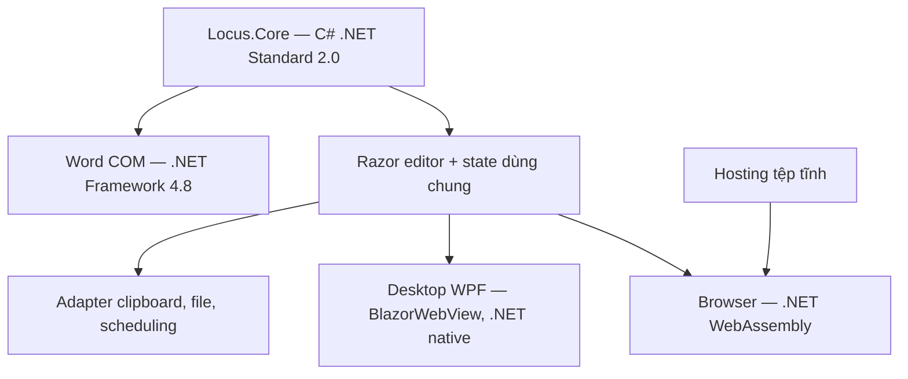

# WEB0 — Quyết định kiến trúc Web/Desktop

Ngày chốt: 2026-09-14. Phạm vi: thử tính khả thi để bắt đầu SH; chưa phát hành Web alpha WEB1. [Kết quả và giới hạn](COMPATIBILITY.md), [cách chạy](QUICKSTART.md).

## Quyết định

Chọn **Blazor WebAssembly cho Web và WPF Blazor Hybrid cho editor dùng chung trong Desktop**. Hai host tham chiếu một Razor Class Library; core C# hiện tại vẫn là nơi nhận diện, parse, tạo candidate, snapshot và export. Bản thử chạy từ tệp tĩnh và không gửi nguồn cho backend phân tích.

Đây là quyết định từ mã đã chạy: 116 nguồn cho cùng kết quả native/WASM/Hybrid; cùng component nhập liệu và scene chạy trên hai host; kéo điểm, Undo, SVG và tải lại đã được kiểm. M2 hiện hành và connector M3 tiếp tục dùng bản đã nghiệm thu; việc đưa editor này thành giao diện sản phẩm thuộc SH/WEB1.

Hybrid thực thi component bằng .NET native trong tiến trình Desktop, không tải WASM cho editor. Đây là cách tái sử dụng Razor components mà Microsoft hỗ trợ trong WPF. [Hướng dẫn WPF Hybrid](https://learn.microsoft.com/en-us/aspnet/core/blazor/hybrid/tutorials/wpf?view=aspnetcore-10.0).

## Ranh giới mã

| Mã hiện tại | Trách nhiệm | Hướng chuyển sang SH |
| --- | --- | --- |
| `src/Locus.Core` | Nguồn UTF-16, chuẩn hóa, parser, candidate, export và snapshot | Giữ một bản dùng trên mọi host; không thêm WPF/DOM/COM |
| `prototypes/web0/Shared/Editor.razor` | UI nguồn/marker/preview/chọn và canvas nhỏ | Tách session/lệnh khỏi component ở SH-01 |
| `Shared/Scene.cs` | Điểm A/B/C, Move, Undo/Redo và xuất SVG | Chốt document/command có phiên bản ở SH-02/03 |
| `Shared/wwwroot/editor.js` | Sự kiện composition/pointer, clipboard/download và adapter thư viện | DOM do module canvas sở hữu; state đã commit do C# sở hữu |
| `Browser` | Host static WASM | UI Web hoàn chỉnh, capability/file/cache ở WEB1 |
| `Hybrid` | Host WPF cho cùng component | Đưa vào tab sản phẩm sau kiểm tương đương với M2 |
| `Native`, `Probe.cs`, `tools/web0` | Baseline, contract, parity, hiệu năng và UI test | Không đưa corpus/test endpoints vào bản Web phát hành |

Flag `--wasm-input-probe` của Hybrid chỉ tạo một WebView2 mở URL static để thử phím Windows/UniKey. Trong nhánh này core chạy bằng WASM trong trang (`data-host=browser`); không khởi tạo Blazor Hybrid hay gọi core native. Nó giúp phân biệt bằng chứng nhập WASM với bằng chứng Hybrid.

## Trạng thái, preview và dữ liệu

- Nguồn người dùng không bị thay bằng chuỗi chuẩn hóa. ID/revision vẫn giữ kiểu của core; parity so chuỗi JSON nguyên vẹn để không làm tròn `long.MaxValue` khi qua JavaScript.
- Một candidate đã chọn cung cấp MathML, LaTeX, OMML và snapshot. Repair có nhãn riêng; prototype không tự chuyển nội dung hay ghi Word.
- Preview công thức WEB0 dùng MathML của browser. M2 dùng renderer WPF; chúng cùng cấu trúc nhưng **chưa có renderer SVG/PNG công thức dùng chung**. SH-03 phải giải quyết phần này và kiểm font/layout/export.
- Canvas thử dùng một Scene C#: pointermove chỉ vẽ tạm, pointerup commit một Move; Esc bỏ kéo; một drag tương ứng một Undo. SVG xuất từ các điểm đã commit.
- Trong SH, canvas phải có vùng DOM riêng do JS quản lý, tránh đồng thời sửa DOM do Razor theo dõi. WEB0 chỉ kiểm một tam giác đơn giản; chưa chứng nhận scene nhiều đối tượng, kéo đồng thời hoặc constraint.
- Cleanup sự kiện/board theo việc phần tử bị gỡ (`MutationObserver`); không gọi JS để dọn DOM từ `DisposeAsync`. Đường cũ gây crash khi reload WebView và đã được sửa. [Hướng dẫn lifecycle JS interop](https://learn.microsoft.com/en-us/aspnet/core/blazor/javascript-interoperability/?view=aspnetcore-10.0#dom-cleanup-tasks-during-component-disposal).

## Giới hạn runtime phải đi vào SH

Browser hiện xử lý đồng bộ trên luồng UI. `CancelAfter` không phải cơ chế ngắt tin cậy cho phép tính đang chiếm luồng đó; timer 1 ms cũng không đảm bảo ngắt một phép tính ngắn trên native. WEB0 giữ toàn bộ raw nhưng từ chối phân tích quá 4.096 đơn vị UTF-16 trước chuẩn hóa. Khi có composition, preview cũ được xóa và đợi hoàn tất ghép ký tự.

SH-01 phải có request ID/revision, bỏ kết quả cũ và scheduling có giới hạn. Trước tác vụ nặng của E1/scene lớn, cần chứng minh đường worker hoặc chia việc thành lượt hữu hạn, cùng timeout/hủy và khả năng nhập tiếp. Không coi `Task.Run` trong browser là bằng chứng có background thread. Không bỏ giới hạn nguồn chỉ vì corpus đúng.

WASM đã publish Release và trim assemblies, nhưng giữ toàn bộ assembly Core/Shared để bảo toàn DataContract serializer và test entry points. Chưa dùng workload `wasm-tools`, AOT hoặc native relinking. WEB1 cần bỏ test bundle, tối ưu payload rồi chạy lại parity trên đúng bản publish. [Build tools và AOT](https://learn.microsoft.com/en-us/aspnet/core/blazor/webassembly-build-tools-and-aot?view=aspnetcore-10.0).

## Thư viện vẽ

Giữ **JSXGraph 1.13.3** làm ứng viên triển khai adapter đồ thị E1. Bản thử tải thư viện từ tài nguyên local, vẽ một curve từ 81 cặp số do C# tính (`x²`) và một điểm kéo được. Không truyền raw tiếng Việt cho parser thư viện. Chưa quyết định dùng JSXGraph cho toàn bộ hình học E2A; cần kiểm constraint, history và scene Locus trước.

Tham khảo Excalidraw cho tương tác chọn/kéo, Undo và export; chưa nhúng editor hoặc thêm dependency Excalidraw. Dự án cung cấp giấy phép MIT. [Repo Excalidraw](https://github.com/excalidraw/excalidraw), [license](https://github.com/excalidraw/excalidraw/blob/master/LICENSE).

## Phiên bản và giấy phép

| Thành phần | Phiên bản thực dùng | Ghi chú |
| --- | --- | --- |
| .NET SDK | 10.0.400 | `global.json` hiện tại |
| Blazor WebAssembly / Components.Web | 10.0.11 | NuGet lock files; [ASP.NET Core MIT](https://github.com/dotnet/aspnetcore/blob/main/LICENSE.txt) |
| .NET runtime WASM | 10.0.11 | [Runtime license](https://github.com/dotnet/runtime/blob/main/LICENSE.TXT); giữ notices trong gói thử |
| Components.WebView.Wpf | 10.0.101 | Target `net10.0-windows10.0.17763.0`; runtime WebView2 riêng |
| JSXGraph | 1.13.3 | Chọn nhánh [MIT](https://github.com/jsxgraph/jsxgraph/blob/v1.13.3/LICENSE.MIT); giữ `JSXGraph-LICENSE.MIT` cạnh bundle |
| Playwright | 1.63.0 | Công cụ kiểm tra, không ship cho người dùng |

WebView2 dùng runtime đã cài trên máy; gói WEB0 static không chứa runtime Windows này. Khi đóng gói Desktop ở SH/M6 phải xử lý phát hiện/cài runtime và điều khoản phân phối theo gói thực dùng.

## Công việc lấy tiếp

1. **SH-01:** session nguồn/candidate/selection, lệnh và scheduling; adapter host có capability rõ.
2. **SH-02:** format Formula/Plot/Geometry, lưu/mở versioned, giữ snapshot cũ và nguồn chưa hỗ trợ.
3. **SH-03/04:** renderer SVG/PNG chung, module editor trong Web/Desktop, kiểm import/export và tương đương với M2.
4. **WEB1:** trải nghiệm công thức đầy đủ, clipboard/file/nháp, ma trận Telex/VNI trên browser phát hành, URL online và offline reload/update.
5. **E1 → E3B/E3A → E2A:** đồ thị 2D, Hóa/Lý cơ bản, hình học 2D theo backlog đã thống nhất.

WEB0 không mở cổng tự động Word; W0 vẫn 4/6 và phản hồi A/B tiếp tục được giữ riêng.
